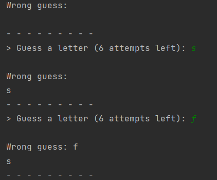

## GUESS.PY
#### Терминальная, остросюжетная игра по угадыванию слов по буквам, написанная на питоне. Автор неизвестен.
### Ход игры.
Игра загадывает слово. Игрок вводит буквы, если эти буквы присутствуют в слове, они отображаются на нужных позициях, если не угадывает - перечисляются в списке ошибок. Ошибок может быть не больше шести. Задача угадать все буквы в слове.
___

___
Для игры необходим файл "sowpods.txt" с набором слов, записанных в верхнем регистре, расположенный в папке data.
___

### get_rand_word(...)
Получает путь и имя файла в котором записаны слова. Возвращает случайно выбранное слово в нижнем регистре.

### get_letter(...)
Принимает оставшееся количество попыток и список угаданных букв.
Возвращает введенный игроком символ в нижнем регистре.
Проверяет что введён один ASCI символ и он не вводился ранее. Иначе выводит сообщения.

### print_game(...)
Принимает списки ошибочно введенных символов, загаданное слово, список правильно введеннных символов.
Осуществляет вывод хода игры в терминал.

### 
### play(...)
Принимает слово. Считает попытки, хранит введенные игроком верные и неверные символы.
Отображает ход игры, проверяет наличие введенного символа в загаданном слове, выводит сообщение о выигрыше или проигрыше.
